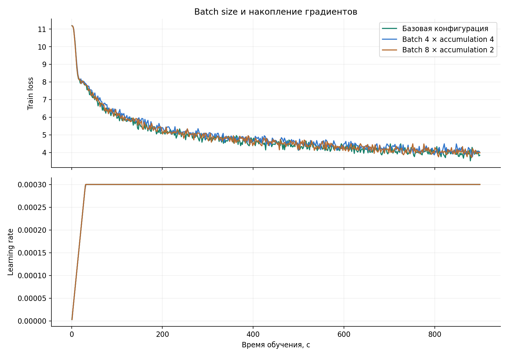
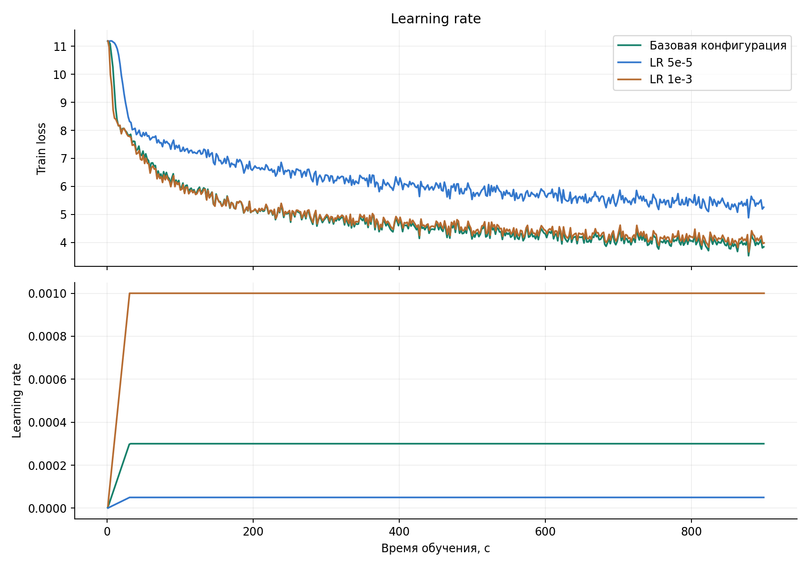
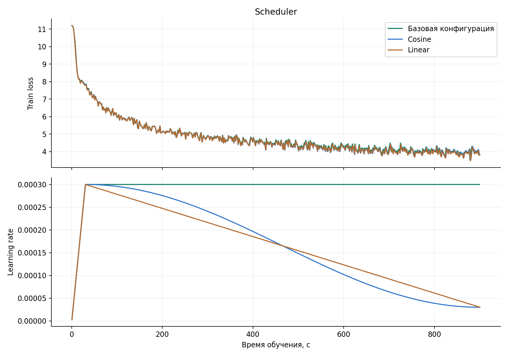
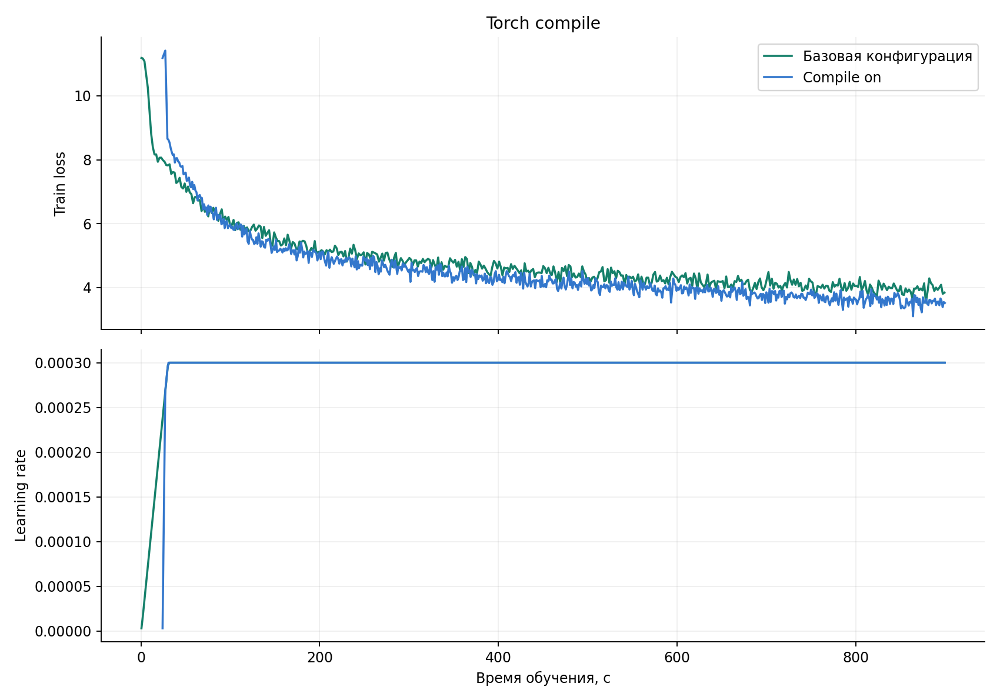
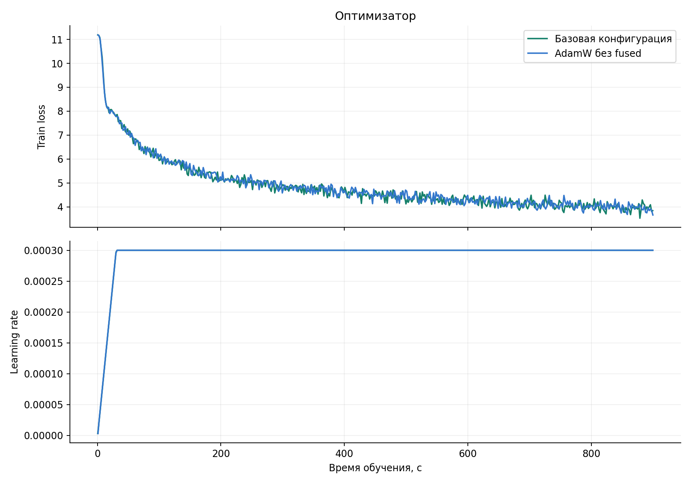
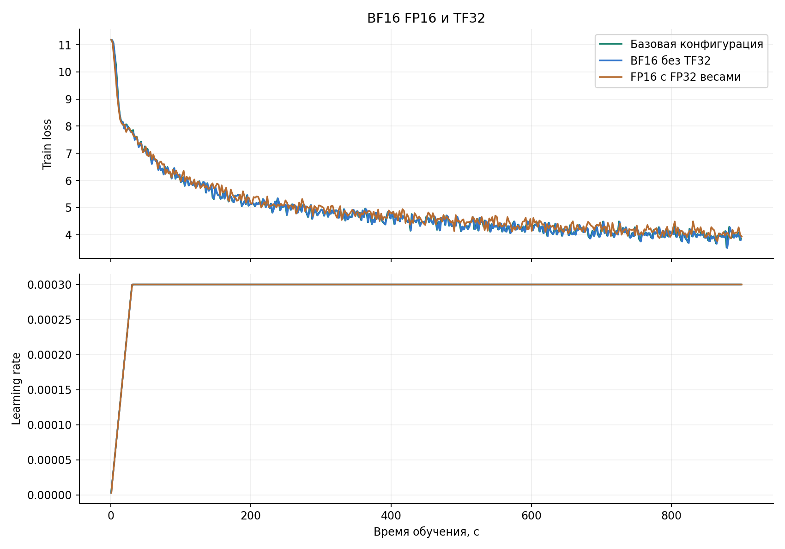

# Мини претрейн Qwen3

## Модель и данные

Qwen3 инициализируется с нуля

Данные — русская Wikipedia 20231101.ru: 1.94млн статей в train и 5тыс в test. Test — первые 5000 исходных строк

Токенизатор — `ai-forever/rugpt3small_based_on_gpt2`. Каждая статья усечена или дополнена справа до 512 токенов

Обучение проводится на одной NVIDIA A100 80GB

## Методика сравнения

Каждый запуск начинает обучение с одинаковой случайной инициализации, seed фиксирован значением 42

Базовые ран: ```batch=16, accumulation=1, LR=3e-4, constant scheduler, AdamW fused, BF16, TF32 включён, compile выключен. Weight decay=0.01, betas=(0.9,0.999), grad clipping=1.0```

Scheduler привязан ко времени: первые 30 секунд — линейный warmup, затем постоянный LR либо cosine/linear decay до 10% начального LR к 900 секундам

Далее в каждом блоке меняется только указанная настройка

До обучения eval_loss базовой модели: **11.21823**

## Batch size и gradient accumulation

Сравниваем пары (16,1), (8,2), (4,4) — (bs, grad acc): эффективный batch всегда 16

| Вариант | Изменение относительно базы | Шаги | Время, с | eval_loss | Perplexity |
|---|---|---:|---:|---:|---:|
| Базовая конфигурация | базовый | 2377 | 900.03 | **4.59280** | 92.80 |
| Batch 4 × accumulation 4 | batch_size=4, accumulation=4 | 2034 | 900.38 | 4.73568 | 107.10 |
| Batch 8 × accumulation 2 | batch_size=8, accumulation=2 | 2221 | 900.09 | 4.63658 | 97.25 |

График во время обучения:


Выводы:
- При эффективном batch 16 увеличение микробатча с 4 до 8 и 16 позволило выполнить 2034, 2221 и 2377 шагов соответственно
- Итоговый eval_loss снизился с 4.73568 до 4.63658 и 4.59280 (цена — рост памяти с ~11 до ~15 и ~22 GB)
- Среди проверенных вариантов предпочтительнее (16, 1)

## Learning rate
Сравниваем темпы обучения lr in [3e-4, 5e-05, 0.001]

| Вариант | Изменение относительно базы | Шаги | Время, с | eval_loss | Perplexity |
|---|---|---:|---:|---:|---:|
| Базовая конфигурация | базовый | 2377 | 900.03 | **4.59280** | 92.80 |
| LR 5e-5 | lr=5e-05 | 2378 | 900.37 | 5.98339 | 375.81 |
| LR 1e-3 | lr=0.001 | 2376 | 900.07 | 4.72365 | 105.82 |

График во время обучения:


Выводы:
- При LR 5e-5 итоговый loss равен 5.98339 => при малом шаге обучение продвинулось заметно меньше 
- LR 1e-3 дал 4.72365, а 3e-4 — 4.59280
- Среди трёх проверенных значений лучше 3e-4 по валидационной метрике

## Scheduler
Сравниваем планировщики lr в [constant, cosine, linear]

| Вариант | Изменение относительно базы | Шаги | Время, с | eval_loss | Perplexity |
|---|---|---:|---:|---:|---:|
| Базовая конфигурация | базовый | 2377 | 900.03 | 4.59280 | 92.80 |
| Cosine | scheduler=cosine | 2373 | 900.23 | 4.62452 | 96.12 |
| Linear | scheduler=linear | 2375 | 900.37 | **4.57593** | 91.45 |

График во время обучения:


Выводы:
- Constant, cosine и linear дали 4.59280, 4.62452 и 4.57593 на валидации соотв.
- Linear оказался немного лучше, но преимущество всего 0.01687 относительно constant

## Torch compile
Сравниваем режимы компиляции в [off, on]

| Вариант | Изменение относительно базы | Шаги | Время, с | eval_loss | Perplexity |
|---|---|---:|---:|---:|---:|
| Базовая конфигурация | базовый | 2377 | 900.03 | 4.59280 | 92.80 |
| Compile on | compile=True | 3572 | 900.18 | **4.22296** | 64.60 |

График во время обучения:


Выводы:
- Число шагов выросло на 50.27% относительно baseline, а eval_loss снизился на 0.36984. 
- Пик памяти сократился с ~22 до ~16 GB. 
P.s. Есть особенность scheduler: warmup привязан к времени, поэтому компиляция поглотила большую часть первых 30 секунд и из-за этого график немного поехал 

## Оптимизатор
Сравниваем оптимизаторы в [fused AdamW, adamw_torch]

| Вариант | Изменение относительно базы | Шаги | Время, с | eval_loss | Perplexity |
|---|---|---:|---:|---:|---:|
| Базовая конфигурация | базовый | 2377 | 900.03 | **4.59280** | 92.80 |
| AdamW без fused | optim=adamw_torch | 2282 | 900.26 | 4.60907 | 94.59 |

График во время обучения:


Выводы:
- Обычный AdamW выполнил 2282 шага против 2377 у fused и получил eval_loss 4.60907 против 4.59280
- Fused быстрее примерно на 4.2% по числу шагов, а различие качества незначительное

## BF16 FP16 и TF32
Сравниваем режимы точности в [bf16 + tf32, bf16 без tf32, fp16 с fp32 весами]

| Вариант | Изменение относительно базы | Шаги | Время, с | eval_loss | Perplexity |
|---|---|---:|---:|---:|---:|
| Базовая конфигурация | базовый | 2377 | 900.03 | 4.59280 | 92.80 |
| BF16 без TF32 | tf32=False | 2374 | 900.01 | **4.57860** | 91.46 |
| FP16 с FP32 весами | dtype=fp16 | 2075 | 900.06 | 4.69374 | 102.73 |

График во время обучения:


Выводы:
- Отключение TF32 при BF16 практически не изменило скорость: 2374 шага против 2377. Loss 4.57860 немного ниже 4.59280
- FP16 с FP32 весами и состояниями оптимизатора дал 4.69374 на валидации, 2075 шагов и ~31 GB памяти => режим оказался медленнее и потребовал больше памяти, чем исходный BF16

## Генерации

Минимальный eval_loss: **4.22296** (Compile on)

Seed: 42

Sampling: ``temperature=0.8, top_p=0.9, top_k=50, max_new_tokens=96, repetition_penalty=1.1``

### Москва — это

```text
Москва — это в настоящее время.

История 

Умер после 1 января 1999 года.

Семья 
Жена (по происхождению) — дочь писателя и драматурга А. С. Пушкина, мать:
 Александр (род. 1960) — советский и российский музыкальный критик, сценарист и режиссёр театра и кино, педагог, заслуженный деятель искусств России, заслуженный артист России.
 Павел (1907—2006) — советский и российский актёр театра и кино, заслуженный
```

### Искусственный интеллект — это

```text
Искусственный интеллект — это в настоящее время.

Миграции 
Кикс-Эвер — это одно из видов, которая была распространена на территории Австралии и Новой Огайо.

Примечания 

Геймовые языки
Народы Северной Америки
Животные, описанные в 1773 году
Фоссилии из триасовых отложений США
Фоссилии из миоценовых отложений Австралии
Фоссилии из триасовых
```

### В 1961 году

```text
В 1961 году в рамках программы «Прогулка» и в течение года стала называться «Филдор» (Ульянова) на телеканале в Гётеборге. С 1976 по 1996 год он являлся одним из ведущих игроков первой игры в Гётеборге.

С 1984 по 1990 год проходил квалификацию в Тольяттинской хоккейной лиге, где работал доцентом команды России. В 1994 году по предложению первого сезона был признан лучшим игроком клуба. После окончания игровой карьеры работал
```

### Вода состоит из

```text
Вода состоит из двух частей, расположенных на территории России, не имеющих половины площади. Площадь водосборного бассейна — 1080 км², длина озера — 1,2 км, наибольшая ширина — 0,7 км. Длина береговой линии составляет 35,5 км. Максимальная глубина береговой линии — 6 м.

Название 
Начало берёт своё начало от основания реки Малые Бесклавы, по которому в целом был левый приток Оки. Длина — около 100 м
```

## Итоговые выводы

Лучший из 11 проверенных вариантов — `compiled`: eval_loss = **4.22296**, perplexity = **64.60**. За 900.18 секунды модель выполнила 3572 шага.

Итоговый выбор среди реально проверенных конфигураций: ```batch 16, accumulation 1, LR 3e-4, linear scheduler, fused AdamW, BF16, без TF32 и включённый torch.compile```