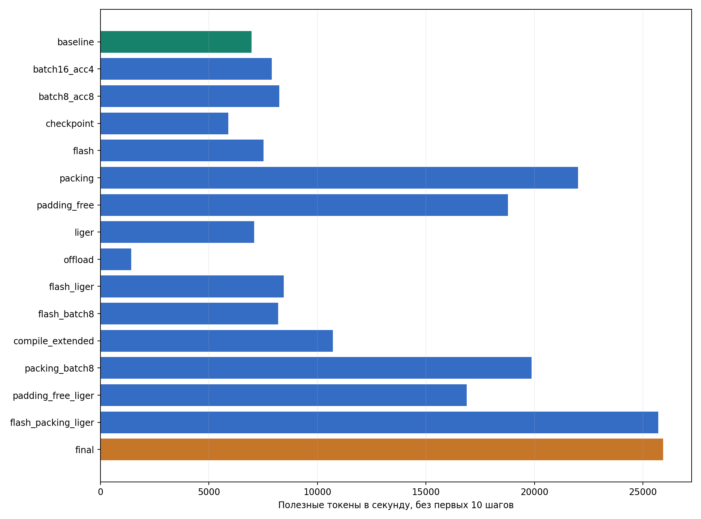
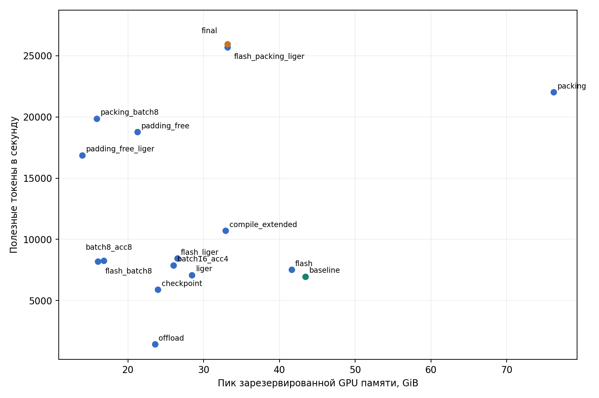

# HW2: ускорение обучения на одной GPU

## Модель, данные и методика

- Модель: Qwen3 с нуля и с seed 42
- GPU: одна NVIDIA A100 80 GB
- Данные: русская Wikipedia `20231101.ru`
- Токенизатор: `ai-forever/rugpt3small_based_on_gpt2`, длина — 512.
- Постоянные настройки: BF16, fused AdamW, LR 3e-4, `constant_with_warmup` с 200 шагами и тот же подсчёт метрик
- Главная метрика: `tokens_per_second` 
- Память в таблицах: пик выделенной памяти в GiB.

## Baseline

| Конфигурация | Время, с | Токенов/с | Память, GiB | Validation loss | Шаги |
|---|---:|---:|---:|---:|---:|
| 32 × 2, SDPA | 300.02 | 6965.0 | 41.24 / 43.44 | 6.61640 | 365 |

## Batch size и gradient accumulation

Эффективный batch во всех вариантах — 64

| Микробатч × накопление | Время, с | Токенов/с | Память, GiB | Validation loss | Шаги |
|---|---:|---:|---:|---:|---:|
| 32 × 2, baseline | 300.02 | 6965.0 | 41.24 / 43.44 | 6.61640 | 365 |
| 16 × 4 | 90.38 | 7887.9 | 24.21 / 26.00 | 8.08293 | 123 |
| 8 × 8 | 90.60 | 8243.0 | 15.71 / 16.83 | 8.02488 | 130 |

Выводы:

- Микробатч 8 дал 8243 токена/с против 6965 у baseline и снизил пик выделенной памяти с 41.24 до 15.71 GiB
- Лосс коротких запусков нельзя напрямую сравнивать с 300-секундным baseline

## Checkpointing и offloading

Важно отметить: offloading с SDPA упал на первом backward из-за выравнивания `attn_bias`. Успешный ран запустился на FlashAttention2, поэтому в эксперименте изменены сразу две настройки

| Конфигурация | Время, с | Токенов/с | Память, GiB | Validation loss | Шаги |
|---|---:|---:|---:|---:|---:|
| Activation checkpointing | 90.09 | 5894.6 | 17.39 / 23.97 | 8.23830 | 91 |
| Activation offloading + FlashAttention2 | 92.00 | 1421.0 | 16.45 / 23.58 | 11.11110 | 19 |

Выводы:
- Checkpointing уменьшил выделенную память примерно на 24 GiB, но снизил скорость до 5895 токенов/с из-за повторного вычисления активаций
- Offloading дал 1421 токен/с: перенос активаций через CPU слишком дорог для этой задачи

## Attention и Liger

| Конфигурация | Время, с | Токенов/с | Память, GiB | Validation loss | Шаги |
|---|---:|---:|---:|---:|---:|
| FlashAttention2 | 90.41 | 7519.8 | 39.30 / 41.60 | 8.09899 | 117 |
| Liger | 90.45 | 7084.0 | 26.83 / 28.47 | 8.16755 | 104 |
| FlashAttention2 + Liger | 90.67 | 8446.6 | 24.89 / 26.51 | 8.03594 | 132 |
| FlashAttention2, batch 8 × 8 | 90.39 | 8191.1 | 15.31 / 16.03 | 8.02893 | 129 |

Выводы:

- FlashAttention2 отдельно: 7520 токенов/с, примерно на 8% больше baseline
- Liger отдельно сильнее сократил память, чем ускорил обучение
- FlashAttention2 + Liger: 8447 токенов/с и 24.89 GiB выделенной памяти
- При batch 8×8 FlashAttention2 не помог: 8191 против 8243 токенов/с у SDPA

## Packing и padding-free

| Конфигурация | Время, с | Токенов/с | Память, GiB | Validation loss | Шаги |
|---|---:|---:|---:|---:|---:|
| FlashAttention2 + packing | 91.02 | 22019.2 | 40.15 / 76.20 | 8.22105 | 62 |
| FlashAttention2 + padding-free | 90.10 | 18775.4 | 15.11 / 21.24 | 6.93935 | 296 |
| FlashAttention2 + packing, batch 8 × 8 | 90.61 | 19870.5 | 15.46 / 15.90 | 8.25292 | 56 |
| FlashAttention2 + padding-free + Liger | 90.28 | 16881.3 | 12.28 / 13.97 | 7.14176 | 257 |
| FlashAttention2 + packing + Liger | 90.19 | 25706.4 | 25.82 / 33.15 | 8.16774 | 71 |

Выводы:
- Packing заполняет блоки длиной 512 короткими абзацами. Скорость выросла до 22тыс полезных токенов/с, но пик зарезервированной памяти достиг 76.20 GiB
- Packing с batch 8×8: 19.9тыс токенов/с при 15.90 GiB зарезервированной памяти.
- Padding-free убрал вычисления по padding без склеивания абзацев: 18.8тыс токенов/с.
- Liger снизил скорость padding-free до 16.9 тыс, зато поднял скорость packing до 25 706 токенов/с. Последнее сочетание стало лучшим в коротких пробах

## Torch compile

| Конфигурация | Время, с | Токенов/с после 10 шагов | С учётом первых шагов | Память, GiB | Validation loss | Шаги |
|---|---:|---:|---:|---:|---:|---:|
| SDPA + compile, короткая проба | 104.72 | — | 61.5 | 26.02 / 26.32 | 11.23464 | 1 |
| SDPA + compile, длинная проба | 180.28 | 10705.9 | 1401.4 | 31.16 / 32.90 | 8.88144 | 46 |

Выводы:

- За 90-секундный бюджет завершился один шаг длительностью 104 секунды
- В 180-секундной пробе скорость после разогрева — 10.7тыс токенов/с, с учётом запуска — 1.4тыс токен/с.
- FlashAttention2 + compile упал из-за ошибки 

## Итоговый запуск

Выбран FlashAttention2 + packing + Liger

| Конфигурация | Время, с | Токенов/с | Память, GiB | Validation loss | Шаги | Целевые токены |
|---|---:|---:|---:|---:|---:|---:|
| Baseline | 300.02 | 6965.0 | 41.24 / 43.44 | 6.61640 | 365 | 2 077 559 |
| FlashAttention2 + packing + Liger | 300.61 | 25941.0 | 25.84 / 33.15 | 6.22691 | 243 | 7 770 222 |

Выводы:

- Ускорение: 25 940.97 / 6964.95 = 3.7245 раза
- Validation loss: 6.61640 -> 6.22691
- Пик зарезервированной памяти: 43.44 → 33.15 GiB.
- Шагов стало меньше, поскольку packed batch содержит больше целевых токенов

### Полезные токены в секунду по всем успешным запускам

### Скорость и пиковая зарезервированная память

## Итоговые выводы
- **Лучший вариант:** FlashAttention2 + packing + Liger
- **Ускорение:** ×3.72 (25 941 ток/с против 6965)
- **Validation loss:** 6.22691 против 6.61640
- **Память:** 33.15 GiB против 43.44 GiB.
- **Packing** — главный источник ускорения, **Liger** — лучший в паре с ним
- **Checkpointing и offloading** экономят память, но сильно замедляют
- **Torch compile** требует долгого разогрева, в коротком бюджете неэффективен